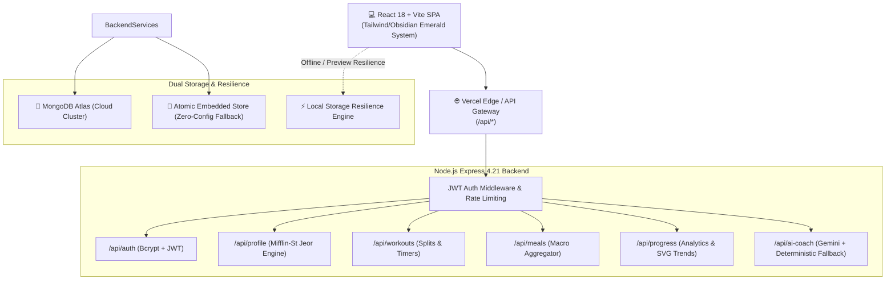

# ⚡ Fit AI — Intelligent Full-Stack Diet & Fitness Coach

<div align="center">


**Empowering sustainable fitness transformations through science-backed calorie calibration, dynamic workouts, and personalized AI coaching.**

[](https://fit-ai-imj2hrg3g-kartik200731mm-2440.vercel.app/)
[](https://github.com/kartik200731mm-hue/FIT-AI-)

[](https://react.dev/)
[](https://www.typescriptlang.org/)
[](https://vitejs.dev/)
[](https://nodejs.org/)
[](https://expressjs.com/)
[](https://ai.google.dev/)
[](https://opensource.org/licenses/MIT)

[🌐 View Live Web App](https://fit-ai-imj2hrg3g-kartik200731mm-2440.vercel.app/) • [✨ Features](#-key-features) • [🏗️ Architecture](#️-system-architecture) • [🚀 Quickstart](#-getting-started) • [🛡️ Safety & Privacy](#️-safety--ethical-guardrails)

</div>

---

## 🌟 Live Demo & Web App

Experience Fit AI live in your browser on desktop, tablet, or smartphone:

🔗 **Production URL**: [https://fit-ai-imj2hrg3g-kartik200731mm-2440.vercel.app/](https://fit-ai-imj2hrg3g-kartik200731mm-2440.vercel.app/)

> **Instant Demo Access**: You can register your own personal account or click **Demo: Beginner Alex** or **Demo: Athlete Sam** on the login page for instantaneous 1-click test exploration!

---

## 💡 Key Features

### 1. 🔐 Authentication & Zero-Leak Data Isolation
- Robust registration, login, session validation, and logout flows.
- Password security via `bcryptjs` with salt hashing.
- JWT-based authentication with strict per-user record isolation across all fitness data.
- Built-in rate limiting (`express-rate-limit`) on sensitive authentication routes.

### 2. 🎯 Precision Profile & Metabolic Calibration
- Adaptive multi-step onboarding calculating:
  - **BMR (Basal Metabolic Rate)**: Accurate Mifflin-St Jeor calculation.
  - **TDEE (Total Daily Energy Expenditure)**: Physical activity multipliers.
  - **Target Calorie & Macro Distribution**: High-protein, balanced carbohydrate, and healthy fat splits tailored to user goals (*Fat Loss, Muscle Gain, Maintenance, Endurance*).
  - **Daily Hydration Targets**: Bodyweight-calibrated water intake goals.

### 3. 🏋️ Smart Workout Programs & Live Session Runner
- Multi-day weekly workout splits (Push/Pull/Legs, Upper/Lower, Full Body Conditioning).
- Dynamic exercise cards with target muscle groups, sets, rep ranges, rest timers, and form cues.
- **Interactive Workout Mode**: Built-in rest timer modal with audio chime and presets (30s, 45s, 60s, 90s, 120s).
- AI Workout Generator that respects user injury notes and joint limitations (e.g. knee/lower-back precautions).

### 4. 🥗 Meal Logging & Nutrition Intelligence
- Daily calorie allowance meters with instant macronutrient breakdown (Protein, Carbs, Fats).
- 1-click logging from a library of nutritious whole foods + custom item creation.
- **Smart Calorie Guidance**: Automatically flags excessive caloric deficits or sudden surplus spikes with healthy adjustment suggestions.
- **AI Food Swap Assistant**: Recommends healthier nutrient-dense alternatives for high-calorie cravings.

### 5. 📈 Progress Analytics & Consistency Grid
- Interactive SVG weight trend visualization with chronological tracking.
- Contextual, non-diagnostic BMI analyzer with athletic caveats and healthy weight reference ranges.
- **28-Day Consistency Heatmap Grid**: Visual activity tracking rewarding daily discipline and consecutive streaks.

### 6. 🤖 Dual-Mode AI Coach Studio
- Conversational wellness coach powered by Google Gemini (with graceful zero-cost fallback to a high-precision deterministic rules engine).
- Context-aware fitness recommendations grounded in user profile metrics and constraints.
- Actionable, easy-to-follow bulleted workout and nutrition advice.

### 7. ⏰ Reminders & 🏆 Gamified Achievements
- User-customizable habit schedules (Workout times, Hydration checks, Meal logs, Weigh-ins).
- Milestone badge unlock system with real-time progress indicators (*First Step, Calibration Master, Iron Will, Macro Tracker, Consistency Champion*).

### 8. 🛡️ User Privacy & Data Portability
- Obsidian Emerald Dark & Crisp Light themes.
- One-click GDPR-compliant **JSON Data Export** (`/api/user/export-data`).
- Permanent account & data deletion with confirmation safety checks.

---

## 🏗️ System Architecture



---

## 🛡️ Safety & Ethical Guardrails

Fit AI strictly adheres to health safety standards and data privacy ethics:

1. **Zero Camera / Computer Vision Access**: The application contains **zero** camera permissions, video feeds, OpenCV models, or posture tracking code. All progress is logged via intentional user input.
2. **Safe Minor Safeguards (<18 years old)**:
   - Restricts caloric restriction or deficit recommendations for users under 18.
   - Replaces adult BMI clinical labels with youth growth guidance.
   - Prioritizes bone development, wholesome nutrition, and natural energy over aggressive body recomposition.
3. **Non-Diagnostic Framing**: All AI suggestions and metrics carry clear educational notices stating that Fit AI provides wellness coaching, not clinical diagnosis or medical prescriptions.

---

## 💻 Tech Stack

| Layer | Technologies |
| :--- | :--- |
| **Frontend** | React 18, TypeScript, Vite 6, Lucide React, Obsidian-Emerald Design System |
| **Backend** | Node.js 22, Express 4.21, TypeScript, Zod Validation, Helmet, CORS |
| **Authentication** | JWT (JSON Web Tokens), Bcrypt.js, HttpOnly Cookies |
| **AI Integration** | Google Gemini API (Flash 1.5/2.0) + Expert Deterministic Engine |
| **Database** | MongoDB / Mongoose + Atomic JSON Fallback Engine |
| **Hosting & CI/CD** | Vercel (Edge Functions, Multi-Service Architecture, Automated GitHub CI/CD) |

---

## 🚀 Getting Started Locally

### Prerequisites
- **Node.js**: v18.0.0 or higher
- **npm**: v9.0.0 or higher

### 1. Clone the Repository
```bash
git clone https://github.com/kartik200731mm-hue/FIT-AI-.git
cd FIT-AI-
```

### 2. Install All Dependencies
```bash
npm run install:all
```
*(Installs root, backend, and frontend packages simultaneously)*

### 3. Environment Configuration
Create a `.env` file in the root directory (or in `backend/`):
```env
# Server Configuration
PORT=5000
NODE_ENV=development

# Authentication
JWT_SECRET=fit_ai_super_secure_jwt_secret_change_in_production_2026_fitness
JWT_EXPIRES_IN=7d

# Database (Optional - defaults to atomic JSON store if omitted)
MONGODB_URI=mongodb://127.0.0.1:27017/fit_ai

# Google Gemini API Key (Optional - falls back to Deterministic Expert Coach if omitted)
GEMINI_API_KEY=your_gemini_api_key_here
```

### 4. Start Development Server
```bash
npm run dev
```
- **Frontend Web App**: [`http://localhost:5173`](http://localhost:5173)
- **Backend API Server**: [`http://localhost:5000`](http://localhost:5000)
- **API Health Check**: [`http://localhost:5000/api/health`](http://localhost:5000/api/health)

---

## 🧪 Testing

Run the automated backend test suites to verify auth, profile calibration, workouts, meals, AI coach cascade, and minor safeguards:

```bash
# Run complete test suite
node backend/test_master_suite.js

# Run specific phase tests
node backend/test_auth_phase2.js
node backend/test_profile_phase3.js
node backend/test_fitness_phase4.js
node backend/test_ai_phase5.js
node backend/test_phase6_safeguards.js
```

---

## 🚢 Deploying to Vercel

Fit AI is preconfigured for 1-click deployment on Vercel:

1. Fork or push this repository to your GitHub account.
2. Go to [Vercel Dashboard](https://vercel.com/new) -> **Add New Project**.
3. Import your `FIT-AI-` repository.
4. Add the following Environment Variables under **Project Settings**:
   - `JWT_SECRET`: *(Any secure random 32+ character string)*
   - `JWT_EXPIRES_IN`: `7d`
   - `GEMINI_API_KEY`: *(Your Google AI Gemini key, optional)*
5. Click **Deploy**. Vercel will automatically build the frontend Vite SPA and connect the backend service.

---

## 📄 License

This project is licensed under the [MIT License](LICENSE).

---

<div align="center">
  <sub>Built with ❤️ for health, fitness, and longevity.</sub>
</div>
